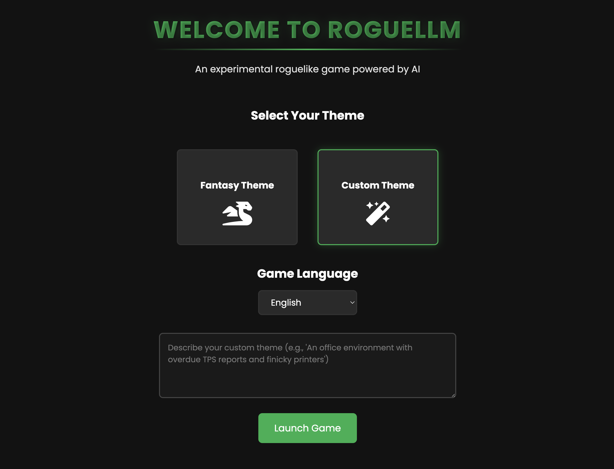

# RogueLLM

RogueLLM is an experimental roguelike game that combines traditional dungeon-crawling
mechanics with LLM (Large Language Model) integration for dynamic gameplay experiences.

The player can request **any kind of setting** for the game to be generated.
Locations, enemies, and items are all procedurally generated based on the theme requested.
The theme request can be as short as a single word (e.g. "fantasy"), or much more detailed,
up to 3,000 characters.

Play mechanics are currently limited to combat and inventory management.



## Overview

The game features:
- **LLM integration** for dynamic narrative and interactions
- Procedurally generated settings
- Item and equipment systems
- Combat mechanics
- Inventory management

## Installation

### Prerequisites
- Python 3.10 or higher
- pip package manager

### Setting up Virtual Environment

#### For MacOS/Linux:
```bash
python3 -m venv venv
source venv/bin/activate
```

#### For Windows:
```bash
python -m venv venv
venv\Scripts\activate
```

### Installing Dependencies
```bash
pip install -r requirements.txt
```

## Model Configuration
RogueLLM uses `gpt-4o-mini` by default, but supports any OpenAI-compatible model. Model settings can be configured in the `.env` file. For example:

```env
# Model configuration (optional)
LOW_SPEC_MODEL_NAME=gemini-2.0-flash-exp
HIGH_SPEC_MODEL_NAME=gemini-2.0-flash-exp
LOW_SPEC_MODEL_BASE_URL=https://generativelanguage.googleapis.com/v1beta/
HIGH_SPEC_MODEL_BASE_URL=https://generativelanguage.googleapis.com/v1beta/
LOW_SPEC_MODEL_API_KEY=...
HIGH_SPEC_MODEL_API_KEY=...
```

## Running the Game
1. Launch with `./run.sh` for MacOS/Linux or `run.bat` for Windows.
2. Open browser and navigate to `http://127.0.0.1:8000/`.

See `game_config.json` and `game_items.json` for more details.

## Icons generation

```bash
python tools/generate_icons.py square_icon.png wide-promotional-image.png
```

## Firebase Analytics Integration (Optional)

The game includes optional Firebase Analytics integration to track basic usage statistics. This is completely optional and the game works perfectly without it.

### Setup

1. Create a project in [Firebase Console](https://console.firebase.google.com/)
2. Add a web app to your project
3. Get your Firebase configuration from the project settings
4. Add the following variables to your `.env.prod` (and `.env.dev` if needed):

```env
# Firebase Configuration (Optional)
FIREBASE_API_KEY=
FIREBASE_AUTH_DOMAIN=
FIREBASE_PROJECT_ID=
FIREBASE_STORAGE_BUCKET=
FIREBASE_MESSAGING_SENDER_ID=
FIREBASE_APP_ID=
FIREBASE_MEASUREMENT_ID=
```

### What's Being Tracked

When Firebase Analytics is configured, the following events are tracked:
- Page views (landing and game pages)
- Game start events with selected theme and language
- Combat events
- Game completion events with basic stats

### Development

Firebase Analytics doesn't track events from localhost by default, but debug mode is automatically enabled in development environments. Check your browser's console to see if events are being tracked correctly.
