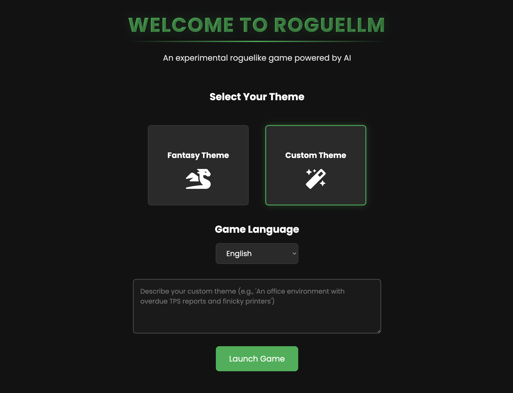

# RogueLLM

RogueLLM is an experimental roguelike game that combines traditional dungeon-crawling
mechanics with LLM (Large Language Model) integration for dynamic gameplay experiences.

The player can request **any kind of setting** for the game to be generated.
Locations, enemies, and items are all procedurally generated based on the theme requested.
The theme request can be as short as a single word (e.g. "fantasy"), or much more detailed,
up to 3,000 characters.

Play mechanics are currently limited to combat and inventory management.



## Overview

The game features:
- **LLM integration** for dynamic narrative and interactions
- Procedurally generated settings
- Item and equipment systems
- Combat mechanics
- Inventory management

## Installation

### Prerequisites
- Python 3.10 or higher
- pip package manager

### Quick Setup (Recommended)

For new developers, use the automated setup script:

```bash
# Clone the repository and navigate to it
git clone <repository-url>
cd roguellm

# Run the setup script
./setup_dev.sh
```

This script will:
- Check Python version compatibility
- Create a virtual environment
- Install all dependencies
- Provide activation instructions

### Manual Setup

If you prefer to set up manually:

#### 1. Create Virtual Environment

```bash
# Create virtual environment
python3 -m venv venv

# Activate it (MacOS/Linux)
source venv/bin/activate

# Or on Windows
venv\Scripts\activate
```

#### 2. Install Dependencies
```bash
pip install --upgrade pip
pip install -r requirements.txt
```

### Development Environment

#### VS Code/Cursor Integration
The project includes VS Code settings that will automatically:
- Detect the virtual environment
- Set the correct Python interpreter
- Enable code formatting and linting

#### Activating the Environment
After initial setup, activate the environment using:

```bash
# Standard activation
source venv/bin/activate

# Or use the convenience script
source activate.sh
```

#### Deactivating
```bash
deactivate
```

## Model Configuration

**⚠️ IMPORTANT**: RogueLLM requires API keys to function. You must configure these before running the application.

### Required Setup

1. **Create a `.env` file** in the project root directory
2. **Copy the template** from `_env.example` to `.env`
3. **Add your API keys** to the `.env` file

### Getting API Keys

- **OpenAI**: Get your API key from [OpenAI Platform](https://platform.openai.com/api-keys)
- **Other providers**: Check their respective documentation

### Basic Configuration

RogueLLM uses `gpt-4o-mini` by default. Minimum required configuration in `.env`:

```bash
# Required: OpenAI API keys
LOW_SPEC_MODEL_API_KEY=your_openai_api_key_here
HIGH_SPEC_MODEL_API_KEY=your_openai_api_key_here
```

### Advanced Configuration

For custom models or providers:

```bash
# Model configuration (optional)
LOW_SPEC_MODEL_NAME=gemini-2.5-flash-preview-05-20
HIGH_SPEC_MODEL_NAME=gemini-2.5-flash-preview-05-20
LOW_SPEC_MODEL_BASE_URL=https://generativelanguage.googleapis.com/v1beta/
HIGH_SPEC_MODEL_BASE_URL=https://generativelanguage.googleapis.com/v1beta/
LOW_SPEC_MODEL_API_KEY=<your_api_key>
HIGH_SPEC_MODEL_API_KEY=<your_api_key>
```

## World Art and Credits

Both paid features are rollout-gated. `ENABLE_WORLD_ART=1` generates the core
bundle by default: one medium-quality hero sheet and one low-quality primary
backdrop, with the map token and gallery cover composed locally. Set
`WORLD_ART_TIER=full` only when the larger all-character/all-location bundle is
intentional.

`ENABLE_WORLD_CREDITS=1` charges 10 credits for forging a new World; playing an
existing World stays free. New accounts receive 30 promotional credits, a
technical forge failure is refunded automatically, and completing a distinct
World earns 1 credit up to 5 times per UTC day. See `_env.example` for the
individual overrides. Creators receive one-time promotional grants when a World
reaches 5, 20, and 50 qualified players: 5, 10, and 20 credits respectively.
The lobby includes a mobile-first credit shop. Web remains a non-purchasing
preview; the Capacitor apps connect it to StoreKit and Play Billing, and the
server verifies every transaction before granting credits. Native purchases
remain separately gated by `ENABLE_MOBILE_STORE=0` until the store products and
server credentials are configured.

## Mobile apps

The iOS and Android projects use Capacitor and ship the web UI inside each app.
They do not point a WebView at the live website. The live server remains the
authority for accounts, Worlds, WebSockets, purchases, and generated assets.
Firebase is used only for optional Analytics; it is not the application or
generated-asset host.

Mobile development requires Node.js 22 or newer. iOS additionally requires
Xcode, while the Android build requires Android Studio/SDK 36 and JDK 21.

```bash
npm ci
npm run mobile:sync
npm run mobile:open:ios
# or
npm run mobile:open:android
```

`npm run mobile:sync` rebuilds `mobile-dist/`, then copies it and the native
plugins into both projects. The build defaults to `https://roguellm.com`; a
staging build can override it without changing source:

```bash
ROGUELLM_API_BASE_URL=https://staging.example.com \
ROGUELLM_PUBLIC_WEB_URL=https://staging.example.com \
ROGUELLM_APPLE_ENVIRONMENT=sandbox \
npm run mobile:sync
```

Mobile login uses short-lived bearer tokens with rotating refresh tokens. The
refresh token lives in the iOS Keychain or Android Keystore-backed secure
storage; access tokens stay in memory. A game WebSocket is authorized through
the opaque session ID returned by the authenticated session-creation request,
so credentials are never placed in WebSocket URLs.

The native product IDs are `credits_40`, `credits_120`, and `credits_300`.
Before turning on purchases, create those as consumables in App Store Connect
and Play Console, configure the Apple and Google verification credentials from
`_env.example` on the server, and then set both `ENABLE_WORLD_CREDITS=1` and
`ENABLE_MOBILE_STORE=1`. The server uses the store transaction ID or purchase
token as its idempotency key and never trusts a client-supplied credit amount.

## Search Provider Configuration

*RogueLLM* uses web search to improve newly generated game descriptions.
Sample setup (env variables or `.env` file):

```bash
# Possible providers: duckduckgo, serpapi
SEARCH_PROVIDER=serpapi
# SerpApi key if using SerpApi provider
SERPAPI_KEY=<your_api_key>
```

Notice that *DuckDuckGo* does not require an API key, but it may rate-limit and fail.

## Running the Game
1. Launch with `./run.sh` for MacOS/Linux or `run.bat` for Windows.
2. Open browser and navigate to `http://127.0.0.1:8000/`.

See `game_config.json` and `game_items.json` for more details.

### Seed Dev Worlds

For repeatable local testing without generating new world definitions, seed stable
dev worlds:

```bash
venv/bin/python tools/ensure_dev_worlds.py
```

This creates or refreshes a Piedone world and a small English fantasy world, seeds
cached language views for dev testing, then prints their World IDs. The local
Quick Start button prefers the seeded Piedone world when it is present.

For reproducible local smoke tests, add a debug seed to a dev quick-start URL:

```bash
http://127.0.0.1:8000/?dev_quick=en-piedone&debug_seed=123
```

`debug_seed` is accepted only from localhost or when `ENABLE_DEBUG_SEED=1` is set.
Normal launches continue to use a fresh seed.

## Icons generation

```bash
python tools/generate_icons.py square_icon.png wide-promotional-image.png
```

## Firebase Authentication and Analytics

Production uses Firebase Authentication for Google and Apple sign-in. Password
signup is deliberately disabled there because the app does not yet operate a
verification/password-reset mail system. Firebase Analytics remains optional.

### Setup

1. Create a project in [Firebase Console](https://console.firebase.google.com/)
2. Add a web app to your project
3. Get your Firebase configuration from the project settings
4. Add the following variables to your `.env` (or `.env.production` on the
   production server):

```env
ENABLE_SOCIAL_AUTH=1
ENABLE_LEGACY_PASSWORD_AUTH=0
ANALYTICS_ENABLED=1
FIREBASE_API_KEY=
FIREBASE_AUTH_DOMAIN=
FIREBASE_PROJECT_ID=
FIREBASE_STORAGE_BUCKET=
FIREBASE_MESSAGING_SENDER_ID=
FIREBASE_APP_ID=
FIREBASE_MEASUREMENT_ID=
```

`FIREBASE_API_KEY`, `FIREBASE_AUTH_DOMAIN`, `FIREBASE_PROJECT_ID`, and
`FIREBASE_APP_ID` are required for social auth. All Firebase values are required
when `ANALYTICS_ENABLED=1`. The application fails at startup when an enabled
Firebase client feature has incomplete configuration.

The native app registrations are checked in as `android/app/google-services.json`
and `ios/App/App/GoogleService-Info.plist`. Firebase OAuth authorized domains
must include `roguellm.com` and `www.roguellm.com`. Apple sign-in on web and
Android additionally requires the Firebase callback URL
`https://roguellm.firebaseapp.com/__/auth/handler` in the Apple Services ID.

### What's Being Tracked

When Firebase Analytics is configured:

- Firebase records automatic page views and sessions on landing and game pages.
- RogueLLM records `game_started` with the selected mode and language.
- User-authored World descriptions and game content are not sent to Analytics.

For a daily traffic count, use **Sessions** as the closest equivalent to visits,
**Total users** for approximate distinct visitors, and **Views** for page loads.

### Development

Analytics is disabled by default in development. Enable it explicitly with a
complete Firebase configuration, then use Google Analytics Realtime or DebugView
to verify collection. Normal reports can take longer to populate.
