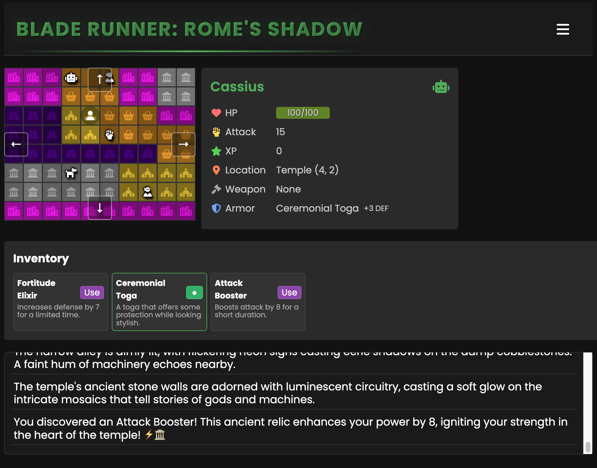

# RogueLLM

RogueLLM is an experimental roguelike game that combines traditional dungeon-crawling
mechanics with LLM (Large Language Model) integration for dynamic gameplay experiences.

The player can request **any kind of setting** for the game to be generated.
Locations, enemies, and items are all procedurally generated based on the theme requested.
The theme request can be as short as a single word (e.g. "fantasy"), or much more detailed,
up to 3,000 characters.

Play mechanics are currently limited to combat and inventory management.



## Overview

The game features:
- **LLM integration** for dynamic narrative and interactions
- Procedurally generated settings
- Item and equipment systems
- Combat mechanics
- Inventory management

## Installation

### Prerequisites
- Python 3.10 or higher
- pip package manager

### Quick Setup (Recommended)

For new developers, use the automated setup script:

```bash
# Clone the repository and navigate to it
git clone <repository-url>
cd roguellm

# Run the setup script
./setup_dev.sh
```

This script will:
- Check Python version compatibility
- Create a virtual environment
- Install all dependencies
- Provide activation instructions

### Manual Setup

If you prefer to set up manually:

#### 1. Create Virtual Environment

```bash
# Create virtual environment
python3 -m venv venv

# Activate it (MacOS/Linux)
source venv/bin/activate

# Or on Windows
venv\Scripts\activate
```

#### 2. Install Dependencies
```bash
pip install --upgrade pip
pip install -r requirements.txt
```

### Development Environment

#### VS Code/Cursor Integration
The project includes VS Code settings that will automatically:
- Detect the virtual environment
- Set the correct Python interpreter
- Enable code formatting and linting

#### Activating the Environment
After initial setup, activate the environment using:

```bash
# Standard activation
source venv/bin/activate

# Or use the convenience script
source activate.sh
```

#### Deactivating
```bash
deactivate
```

## Model Configuration
RogueLLM uses `gpt-4.1-mini` by default, but supports any OpenAI-compatible model. Model settings can be set as environment variables (also in `.env`).
Example:

```bash
# Model configuration (optional)
LOW_SPEC_MODEL_NAME=gemini-2.5-flash-preview-05-20
HIGH_SPEC_MODEL_NAME=gemini-2.5-flash-preview-05-20
LOW_SPEC_MODEL_BASE_URL=https://generativelanguage.googleapis.com/v1beta/
HIGH_SPEC_MODEL_BASE_URL=https://generativelanguage.googleapis.com/v1beta/
LOW_SPEC_MODEL_API_KEY=<your_api_key>
HIGH_SPEC_MODEL_API_KEY=<your_api_key>
```

## Search Provider Configuration

*RogueLLM* can use web search to improve the game description.
Sample setup (env variables or `.env` file):

```bash
# Possible providers: duckduckgo, serpapi
SEARCH_PROVIDER=serpapi
# SerpApi key if using SerpApi provider
SERPAPI_KEY=<your_api_key>
```

Notice that *DuckDuckGo* does not require an API key, but it may rate-limit and fail.

## Running the Game
1. Launch with `./run.sh` for MacOS/Linux or `run.bat` for Windows.
2. Open browser and navigate to `http://127.0.0.1:8000/`.

See `game_config.json` and `game_items.json` for more details.

## Icons generation

```bash
python tools/generate_icons.py square_icon.png wide-promotional-image.png
```

## Firebase Analytics Integration (Optional)

The game includes optional Firebase Analytics integration to track basic usage statistics. This is completely optional and the game works perfectly without it.

### Setup

1. Create a project in [Firebase Console](https://console.firebase.google.com/)
2. Add a web app to your project
3. Get your Firebase configuration from the project settings
4. Add the following variables to your `.env`:

```env
# Firebase Configuration (Optional)
FIREBASE_API_KEY=
FIREBASE_AUTH_DOMAIN=
FIREBASE_PROJECT_ID=
FIREBASE_STORAGE_BUCKET=
FIREBASE_MESSAGING_SENDER_ID=
FIREBASE_APP_ID=
FIREBASE_MEASUREMENT_ID=
```

### What's Being Tracked

When Firebase Analytics is configured, the following events are tracked:
- Page views (landing and game pages)
- Game start events with selected theme and language
- Combat events
- Game completion events with basic stats

### Development

Firebase Analytics doesn't track events from localhost by default, but debug mode is automatically enabled in development environments. Check your browser's console to see if events are being tracked correctly.
